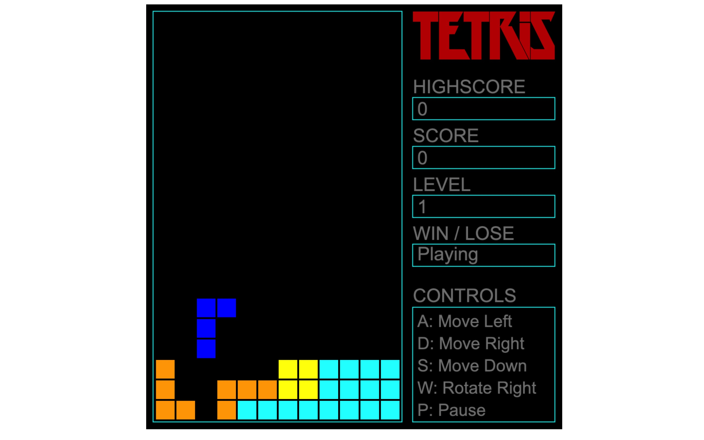
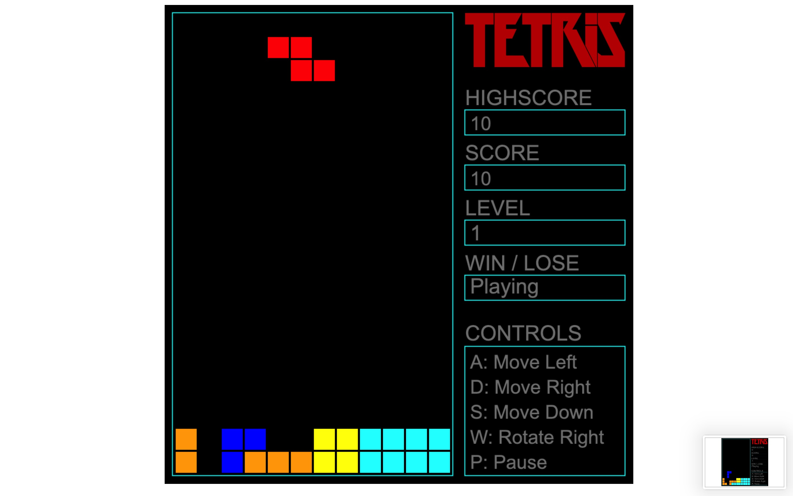

# tetris

#### Play the game [here](garvit-exe.github.io/tetris) or [here](tetris-by-garvit.vercel.com).

## Getting Started

### Prerequisites

To run this project, you need a modern web browser that supports HTML5 and JavaScript.

### Installation

1. Clone the repository:

    ```sh
    git clone https://github.com/yourusername/tetris.git
    cd tetris
    ```

2. Open the `index.html` file in your preferred web browser:

    ```sh
    open index.html
    ```

## Project Structure

- `index.html`: The main HTML file that sets up the canvas.
- `style.css`: The CSS file for styling the game canvas and the body.
- `logic.js`: The JavaScript file containing the game logic.

## How to Play

- Use the following keys to control the game:
  - `A`: Move left
  - `D`: Move right
  - `S`: Move down
  - `W`: Rotate the tetromino
  - `P`: Pause the game

- The game will end if the tetrominoes reach the top of the game board.
- The score and level will be displayed on the right side of the game board.

## Features

- Random tetromino generation
- Tetromino rotation and movement
- Collision detection
- Line clearing
- Score and level tracking
- Pause functionality
- High score saving using `localStorage`

## Screenshots




## License

This project is licensed under the MIT License - see the [LICENSE](LICENSE) file for details.
